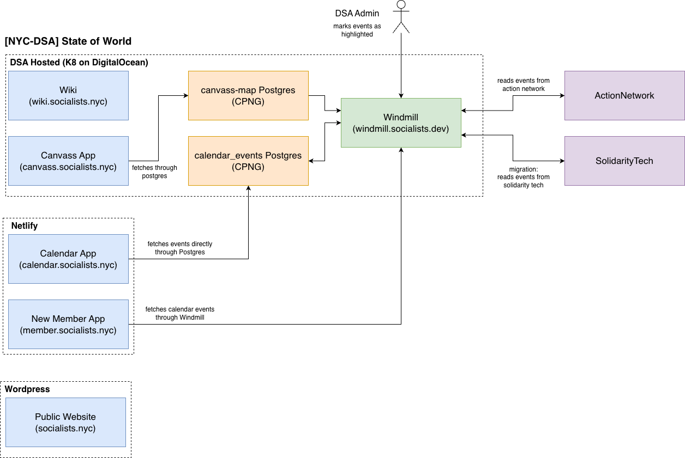

# Systems map

Every live surface T&T runs or cares about, one paragraph each.

Diagram may be incomplete (pieced together from code + infra) — PRs welcome.

## Member-facing

### Public website — [socialists.nyc](https://socialists.nyc)

WordPress. The chapter's front door and our most important SEO asset (first Google result for "nyc dsa").

### Calendar — [calendar.socialists.nyc](https://calendar.socialists.nyc)

React SPA (MUI) on Netlify; Netlify functions talk to a Postgres database via Prisma. Public, no login. (The repo has self-host paths too; Netlify is what's live.) Repo: [`nyc-dsa-calendar`](https://github.com/nycdsa/nyc-dsa-calendar).

### Canvass map — [canvass.socialists.nyc](https://canvass.socialists.nyc)

TanStack Start + Tailwind/shadcn, Bun runtime, Prisma against its own Postgres on our Kubernetes cluster. Windmill syncs canvassing events from Action Network into its database. Public. Repo: [`canvass-map`](https://github.com/nycdsa/canvass-map).

### New member app — [member.socialists.nyc](https://member.socialists.nyc)

React/Vite SPA on Netlify with an onboarding checklist and event suggestions; Netlify functions call Windmill as the backend; Keycloak for login. Repo: [`new-member-app`](https://github.com/nycdsa/new-member-app).

### Wiki — [wiki.socialists.nyc](https://wiki.socialists.nyc)

DokuWiki, hosted via Cloudron (not the main K8s stack). Members-only; DSA login works via a DokuWiki OIDC plugin pointed at Keycloak. Repos: [`wiki-conf`](https://github.com/nycdsa/wiki-conf), [`wiki-data`](https://github.com/nycdsa/wiki-data), [`mikio-dokuwiki-template`](https://github.com/nycdsa/mikio-dokuwiki-template).

## Shared infrastructure

### Kubernetes cluster ("the DSA cloud")

Self-managed K8s on DigitalOcean, defined with Pulumi in [`infrastructure`](https://github.com/nycdsa/infrastructure). Runs the canvass app, Postgres databases, Windmill, and related services.

### Keycloak

Our identity provider (IdP) — one DSA login across apps. Lives in the `nycdsa` realm, currently hosted on Cloudron. Access governance (who is in which groups, which groups grant which app roles) is handled by the [`access-management`](https://github.com/nycdsa/access-management) portal, not by hand-assigning roles to users.

### Windmill

Self-hosted workflow/automation platform (think open-source Zapier/retool for scripts). Syncs data from Action Network and SolidarityTech into our Postgres databases and serves as a lightweight backend for the member app. Repo: [`member-app-windmill`](https://github.com/nycdsa/member-app-windmill).

## Also T&T territory

| Thing | What it is |
|-------|------------|
| Organizer tools | [`onboarder-app`](https://github.com/nycdsa/onboarder-app), [`phone-tree`](https://github.com/nycdsa/phone-tree), [`canvass-with-me`](https://github.com/nycdsa/canvass-with-me) — leadership/organizer-only tooling with access to PII |
| Shopify store | shop.socialists.nyc |
| WG microsites | e.g. [`nyc-dsa-healthcare.github.io`](https://github.com/nycdsa/nyc-dsa-healthcare.github.io), [`tech-action-working-group`](https://github.com/nycdsa/tech-action-working-group) (techaction.nyc), powerup.nyc — standalone working-group sites |
| The Thorn | Chapter-adjacent news site (thethorn.nyc, Jekyll) — [`the-thorn`](https://github.com/nycdsa/the-thorn) |
| results / ballot sites | Election-cycle one-offs (results.socialists.nyc, ballot.socialists.nyc) — ballot: [`vote-dsa-down-the-ballot`](https://github.com/nycdsa/vote-dsa-down-the-ballot) |
